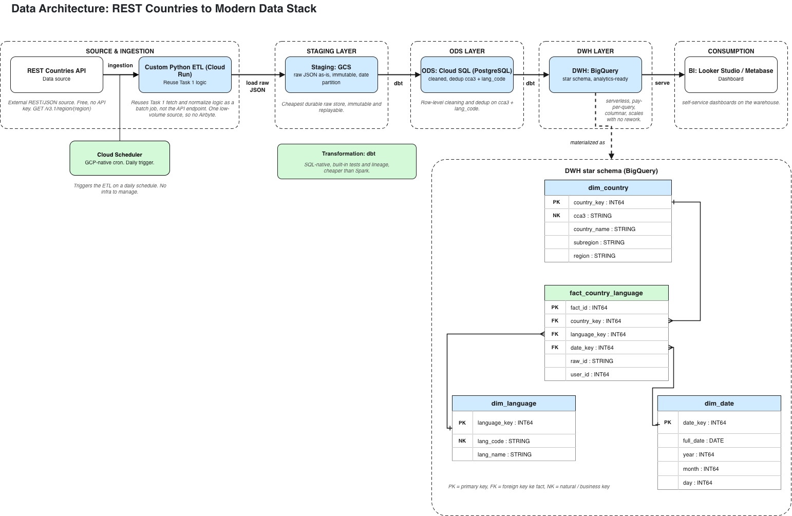

# rekom-data-engineer-test

REST API that takes a region input, hits the [REST Countries API](https://restcountries.com),
explodes each country's `languages` dict into one row per language, stores everything in
PostgreSQL, and returns the normalized entries as JSON.

## Stack

- **FastAPI + asyncpg** — async all the way, COPY bulk insert to keep DB round trips to one
- **httpx** — non-blocking HTTP client
- **Pydantic v2** — validates raw_id (13 chars) and user_id (7 digits) before anything hits the DB
- **Docker + compose** — app + postgres, with a healthcheck gate so app waits for DB to be ready

## Running

**Docker:**
```bash
cp .env.example .env
docker compose up -d --build
```

**Local:**
```bash
python -m venv .venv && source .venv/bin/activate
pip install -r requirements.txt
cp .env.example .env
psql "$DATABASE_URL" -f db/schema.sql
uvicorn app.main:app --reload
```

Swagger UI at http://localhost:8000/docs

## Usage

```
POST /countries
```

```json
{
  "raw_id": "p3kw91zrx42mb",
  "user_id": "7284015",
  "region": "asia"
}
```

Returns `raw_id`, `user_id`, `region`, `total_countries` (number of countries, not rows),
and `returned_entries` (one entry per language). Iraq for example gives 3 entries: `ara`, `arc`, `ckb`.

## Tests

```bash
pytest
```

Covers the normalization logic without network: Iraq producing 3 rows, total_countries vs
row count, countries with no languages, and DB tuple ordering.

## Notes

- `raw_id` and `user_id` come from the caller, not generated server-side (clarified with HR).
- `region` stored in DB uses the API's casing (`Asia`), response echoes the input (`asia`).
- Re-ingesting the same payload appends duplicate rows — no dedup at this layer, that belongs in ODS.

## Architecture (Task 2)


